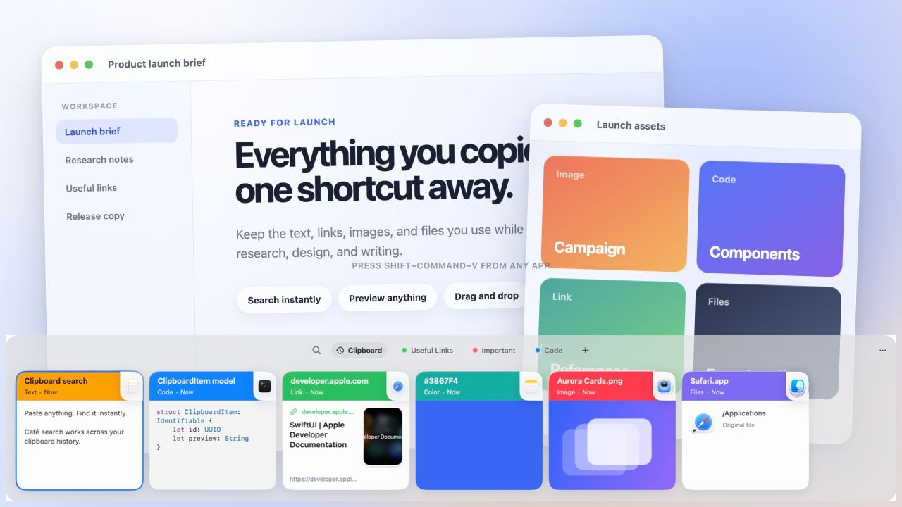
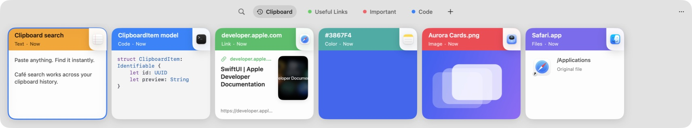
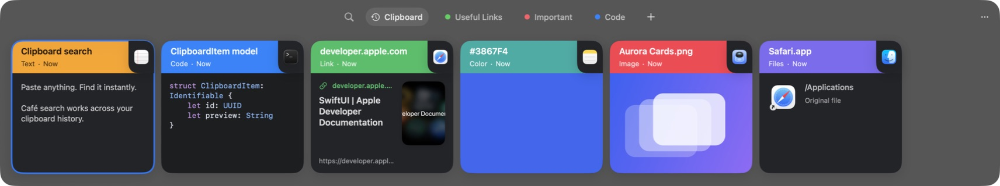
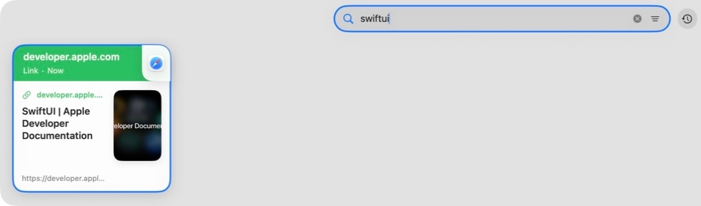
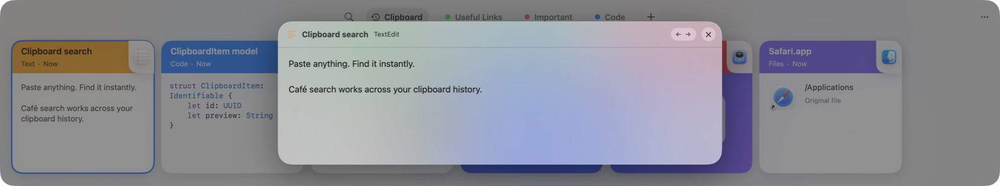
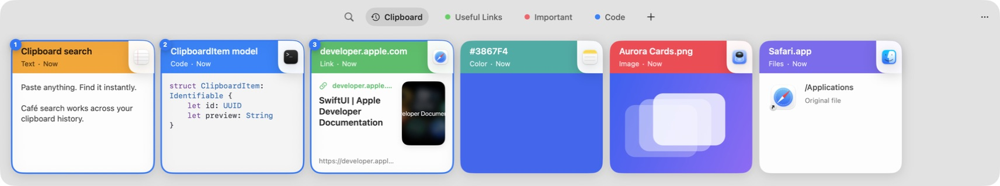

<p align="center">
  
</p>

<h1 align="center">Passst — free, open-source clipboard manager for macOS</h1>

<p align="center">
  A fast, visual, local-first clipboard history for Mac.<br>
  Search everything you copied, organize it with Pinboards, preview it, and paste without breaking your flow.
</p>

<p align="center">
  <a href="https://github.com/dvvolynkin/Passst/releases/latest/download/Passst-0.2.2-macos-universal.dmg"><strong>Download for macOS</strong></a>
  ·
  <a href="#quick-start">Quick start</a>
  ·
  <a href="#privacy">Privacy</a>
</p>

<p align="center">
  
  
  <strong>Universal 2 · arm64 + x86_64</strong>
  <a href="LICENSE"></a>
</p>



Passst is a native macOS clipboard manager that stays out of the way until you press
`Shift+Command+V`. It opens as a full-width glass panel at the bottom of the current
display, with the latest clipboard item already selected and ready to copy or paste.

## Quick start

1. Download **Passst 0.2.2** from the [latest release](https://github.com/dvvolynkin/Passst/releases/latest).
2. Open the DMG and drag Passst to **Applications**.
3. Passst is ad-hoc signed but not notarized. Control-click Passst and choose
   **Open**. If macOS still blocks it, use **System Settings → Privacy & Security → Open Anyway**.
4. Press `Shift+Command+V`.
5. Grant Accessibility only if you want `Enter` to paste directly into the app you were using.

Passst works on macOS 14 and newer, on both Apple Silicon and Intel Macs.

## A visual clipboard manager without the clutter

- **Search immediately.** Start typing or press `Command+F`; results update as you type.
- **Filter precisely.** Narrow results by content type, source app, or date with removable
  filters and type-ahead suggestions.
- **Organize with Pinboards.** Create color-coded collections, then pin an item from its menu
  or drag it directly onto a pinboard.
- **Preview before pasting.** Press `Space` for a large text, image, link, or file preview.
- **Select in order.** Use `Command`-click for individual items or `Shift` to extend a range.
- **Paste where you were.** `Enter` returns to the previous app and sends `Command+V`.
- **Keep formatting—or do not.** `Shift+Enter` pastes the selection as plain text.
- **Drag it anywhere.** Drag text, links, images, and original files into another app.
- **Name it clearly.** File and image cards use the original filename when available; any
  item can also be renamed inside Passst.
- **Stay local.** History and its full-text index live on this Mac.

### Light and dark

| Light | Dark |
| --- | --- |
|  |  |

### Search



Click the search icon, start typing, or use `Command+F`. Suggestions can turn a phrase such
as `link` or `last week` into an active filter. The filter menu exposes content type, source
app, and date; each active chip can be removed without clearing the text query. The first
`Escape` clears search and filters; the next closes Passst.

### Pinboards and drag-and-drop

Pinboards share the compact top bar with search. Use `+` to create one, choose its color,
and pin an item from the card menu—or drag the card onto the pinboard. An item belongs to
one pinboard at a time. Deleting a pinboard keeps its clipboard items in the main history.

Cards can also be dragged out of Passst. Files preserve the original file URL, images use
their full-resolution PNG representation, links remain URLs, and text stays text.

### Large preview



Press `Space` to open or close the preview. Use the arrow keys to inspect nearby items
without leaving it.

### Ordered multi-selection



The numbered badges show the output order. Text and links are joined with line breaks,
files stay grouped, and image items remain separate pasteboard items.

## Keyboard shortcuts

| Action | Shortcut |
| --- | --- |
| Open or close Passst | `Shift+Command+V` |
| Search | Type, or `Command+F` |
| Move through history | `←` / `→` |
| Extend the selection | `Shift+←` / `Shift+→` |
| Select individual cards | `Command`-click |
| Preview the focused item | `Space` |
| Copy the ordered selection | `Command+C` |
| Paste into the previous app | `Enter` |
| Paste as plain text | `Shift+Enter` |
| Clear search / close Passst | `Escape` |

A double-click pastes the clicked card. Vertical mouse-wheel movement is translated into
horizontal history scrolling; trackpads keep their native inertia.

## Content previews

Passst keeps the original pasteboard representations and builds a suitable card for:

- plain text, formatted RTF/HTML, and source code;
- web links with title, domain, and preview image;
- images and colors;
- files and Finder selections;
- mixed and ordered multi-item copies.

Every card records the source application name and icon when macOS makes that information
available. Copying the same payload again moves its existing record to the front.

Right-click a card to paste it, paste it as plain text, copy it, rename its Passst title,
pin or unpin it, or delete it. Renaming does not rename the original file.

## Accessibility

Accessibility permission is **not** required for clipboard history, search, previews, or
`Command+C`. It is only used for direct paste:

1. Passst writes the selected payload to the system clipboard.
2. It closes the panel and restores the previously active app.
3. It sends `Command+V`.

Without permission, Passst still copies the selection and tells you to paste manually.
The permission can be reviewed in **System Settings → Privacy & Security → Accessibility**.

## Privacy

- History is stored under `~/Library/Application Support/Passst`.
- There is no Passst account, cloud sync, analytics, advertising, or telemetry.
- Concealed and transient pasteboard data—including common password-manager payloads—is ignored.
- Applications can be excluded in Settings.
- Link previews use macOS Link Presentation and may contact the copied website to retrieve
  its title and preview image.
- Clearing history removes the local database, payload files, and thumbnails.

Please never attach real clipboard databases or sensitive clipboard screenshots to bug reports.

## Troubleshooting

<details>
<summary><strong>macOS says Passst cannot be opened</strong></summary>

This release is ad-hoc signed and not notarized. Control-click the app and choose **Open**.
If needed, open **System Settings → Privacy & Security** and choose **Open Anyway**.
</details>

<details>
<summary><strong>Shift+Command+V does not open Passst</strong></summary>

Open Passst from the menu bar, then open Settings and record the shortcut again. Also check
whether another clipboard manager still owns the same global shortcut.
</details>

<details>
<summary><strong>Enter copies but does not paste</strong></summary>

Enable Passst under **System Settings → Privacy & Security → Accessibility**, then try again.
`Command+C` and manual `Command+V` continue to work without this permission.
</details>

<details>
<summary><strong>A website appears in the network log</strong></summary>

Passst fetches metadata for visible link cards through macOS Link Presentation. It does not
upload the rest of your clipboard history.
</details>

## Build from source

Requirements:

- macOS 14 or newer;
- Xcode 16+ with Swift 6, or a compatible Swift 6 toolchain;
- [XcodeGen](https://github.com/yonaskolb/XcodeGen) only if you want an `.xcodeproj`.

```sh
swift build
swift test
```

To create the Universal 2 application, DMG, ZIP, and checksums:

```sh
scripts/package-app.sh release 0.2.2 8
```

The repository contains both `Package.swift` and `project.yml`. GRDB provides SQLite and
full-text search; KeyboardShortcuts manages the configurable global shortcut.

## Scope

Passst is intentionally local-first. Clipboard history, filtered search, Pinboards,
drag-and-drop, previews, selection, copy, and paste are included. Cloud sync, OCR, and a
cross-device history are not.

<details>
<summary><strong>Comparing clipboard managers?</strong></summary>

If you are looking for a free, open-source alternative to Paste, Passst focuses on the
visual clipboard workflow on a single Mac: horizontal cards, instant search, Pinboards,
previews, ordered multi-selection, plain-text paste, and drag-and-drop. It does not aim for
feature parity with cross-device products and currently has no iPhone or iPad app, cloud
sync, OCR, shared Pinboards, or automatic updates.

Passst is an independent project and is not affiliated with Paste or its developers.
</details>

## License

Passst is available under the [MIT License](LICENSE).
